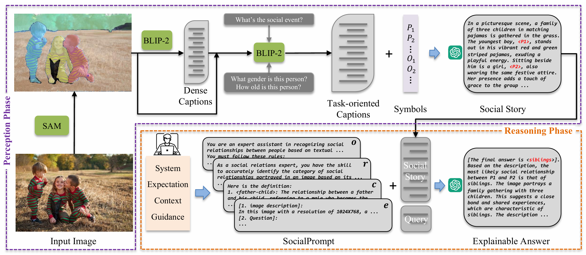

# SocialGPT: Prompting LLMs for Social Relation Reasoning via Greedy Segment Optimization

Created by [Wanhua Li](https://li-wanhua.github.io/)\*, [Zibin Meng](https://scholar.google.com/citations?hl=en&user=_n5g8KUAAAAJ)\*, [Jiawei Zhou](https://sites.harvard.edu/jzhou/), [Donglai Wei](https://donglaiw.github.io/), [Chuang Gan](https://people.csail.mit.edu/ganchuang/), [Hanspeter Pfister](https://vcg.seas.harvard.edu/people/hanspeter-pfister)

This repository contains PyTorch implementation for paper "SocialGPT: Prompting LLMs for Social Relation Reasoning via Greedy Segment Optimization" (NeurIPS 2024). 

SocialGPT is a simple yet well-crafted framework, which combines the perception capability of Vision Foundation Models (VFMs) and the reasoning capability of Large Language Models (LLMs) within a modular framework, providing a strong baseline for social relation recognition. Without additional model training, it achieves competitive zero-shot results on two datasets while offering interpretable answers, as LLMs can generate language-based explanations for the decisions. We further propose the Greedy Segment Prompt Optimization (GSPO), which performs a greedy search by utilizing gradient information at the segment level as an automated prompt optimization method.



[[Project Page]](https://mengzibin.github.io/SocialGPT.github.io/) [arXiv](https://arxiv.org/pdf/2410.21411)

## Installation

Download the checkpoint of Segment-Anything Model ([ViT-H SAM model](https://dl.fbaipublicfiles.com/segment_anything/sam_vit_h_4b8939.pth), [ViT-B SAM model](https://dl.fbaipublicfiles.com/segment_anything/sam_vit_b_01ec64.pth)) (We use vit-h by default) and put it in the `pretrained_models` folder. Download the checkpoint of [Vicuna](https://huggingface.co/lmsys/vicuna-7b-v1.5-16k) (We use vicuna-7b-v1.5-16k by default) and put it in the vicuna-7b-v1.5-16k folder. 

## Projects

1. **social-story-main-PIPA**: Uses ChatGPT to extract stories and identify social relationships from the PIPA dataset.
2. **social-story-main-PISC**: Uses ChatGPT to extract stories and identify social relationships from the PISC dataset.
3. **GSPO-PIPA**: Applies Long Prompt Optimization with GSPO in the PIPA dataset.
4. **GSPO-PISC**: Applies Long Prompt Optimization with GSPO in the PISC dataset.

## Running the Code

Each component of the SocialGPT project is contained within its own sub-directory. Navigate to the appropriate directory and refer to its README.md for detailed instructions on how to run the code:

| Component                              | Running Method                                               |
| -------------------------------------- | ------------------------------------------------------------ |
| PIPA Story and Relationship Extraction | Check the [social-story-main-PIPA.md](./social-story-main-PIPA/README.md) for detailed instructions on story extraction and relationship recognition |
| PISC Story and Relationship Extraction | Check the [social-story-main-PISC.md](./social-story-main-PISC/README.md) for detailed instructions on story extraction and relationship recognition |
| GSPO for PIPA                          | Check the [GSPO-PIPA.md](./GSPO-PIPA/README.md) to apply GSPO techniques for long prompt optimization in PIPA |
| GSPO for PISC                          | Check the [GSPO-PISC.md](./GSPO-PISC/README.md) to apply GSPO techniques for long prompt optimization in PISC |

## License

MIT License

## Acknowledgements

The code is based on [image2paragraph](https://github.com/showlab/Image2Paragraph), [llm-attacks](https://github.com/llm-attacks/llm-attacks) and [segment anything](https://github.com/facebookresearch/segment-anything).

## Citation

If you find our work useful in your research, please consider citing:

```
@article{li2024SocialGPT,
  title = {SocialGPT: Prompting LLMs for Social Relation Reasoning via Greedy Segment Optimization},
  author = {Li, Wanhua and Meng, Zibin and Zhou, Jiawei and Wei, Donglai and Gan, Chuang and Pfister, Hanspeter},
  journal = {Advances in Neural Information Processing Systems (NeurIPS)},
  year = {2024}
}
```

